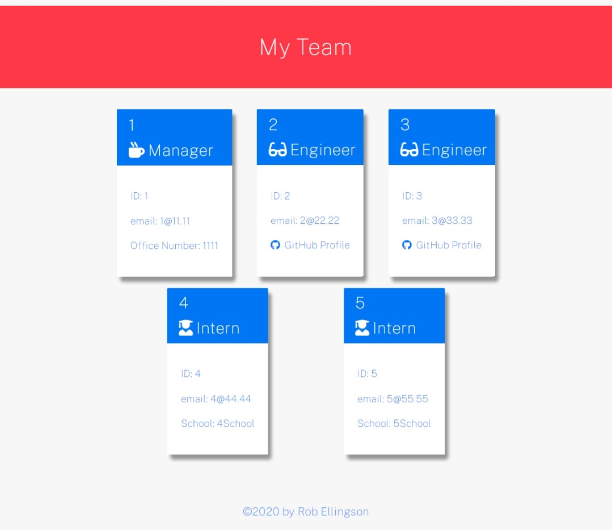

# 10 Object-Oriented Programming: Team Profile Generator

## Author: Rob Ellingson
- Source: [Github](https://github.com/awolrob/team-profile)

---
    AS A manager
    I WANT to generate a webpage that displays my team's basic info
    SO THAT I have quick access to their emails and GitHub profiles

    GIVEN a command-line application that accepts user input
    WHEN I am prompted for my team members and their information
    THEN an HTML file is generated that displays a nicely formatted team roster based on user input
    WHEN I click on an email address in the HTML
    THEN my default email program opens and populates the TO field of the email with the address
    WHEN I click on the GitHub username
    THEN that GitHub profile opens in a new tab
    WHEN I start the application
    THEN I am prompted to enter the team manager’s name, employee ID, email address, and office number
    WHEN I enter the team manager’s name, employee ID, email address, and office number
    THEN I am presented with a menu with the option to add an engineer or an intern or to finish building my team
    WHEN I select the engineer option
    THEN I am prompted to enter the engineer’s name, ID, email, and GitHub username, and I am taken back to the menu
    WHEN I select the intern option
    THEN I am prompted to enter the intern’s name, ID, email, and school, and I am taken back to the menu
    WHEN I decide to finish building my team
    THEN I exit the application, and the HTML is generated
---
    Employee parent class with the following properties and methods:

    name

    id

    email

    getName()

    getId()

    getEmail()

    getRole() // Returns 'Employee'
---    
    Manager will also have:

    officeNumber

    getRole() // Overridden to return 'Manager'
---
    Engineer will also have:

    github // GitHub username

    getGithub()

    getRole() // Overridden to return 'Engineer'
---
    Intern will also have:

    school

    getSchool()

    getRole() // Overridden to return 'Intern'

## Install
* npm install jest
* npm install inquirer

## Run
* node index.js
* Open [index.html](./dist/index.html) in your browser after executing 'Node index' from the command line.

## Mock-Up

The following image shows the generated HTML’s appearance and functionality. The styling in the image is just an example, so feel free to add your own styles:

## Final Page

The following image was generated using the index.js application:

## Video

The following video was generated using the index.js application:

Testing, entering and crating the HTML webpage titled “My Team”.
https://drive.google.com/file/d/1eIaWMg95Ie9gTTIB7Z60Yeiu2vRcpoLz/view?usp=sharing

- - -
` https://github.com/awolrob | 2021-07-31 ` 